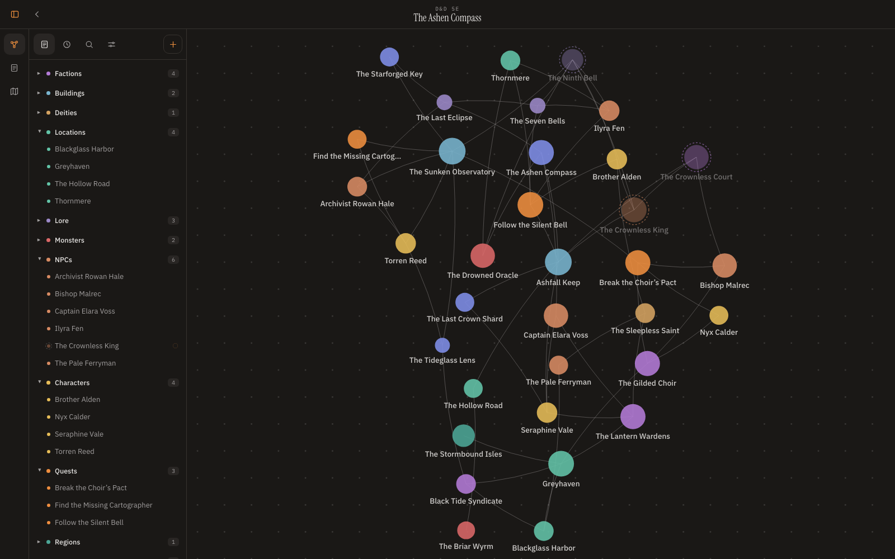
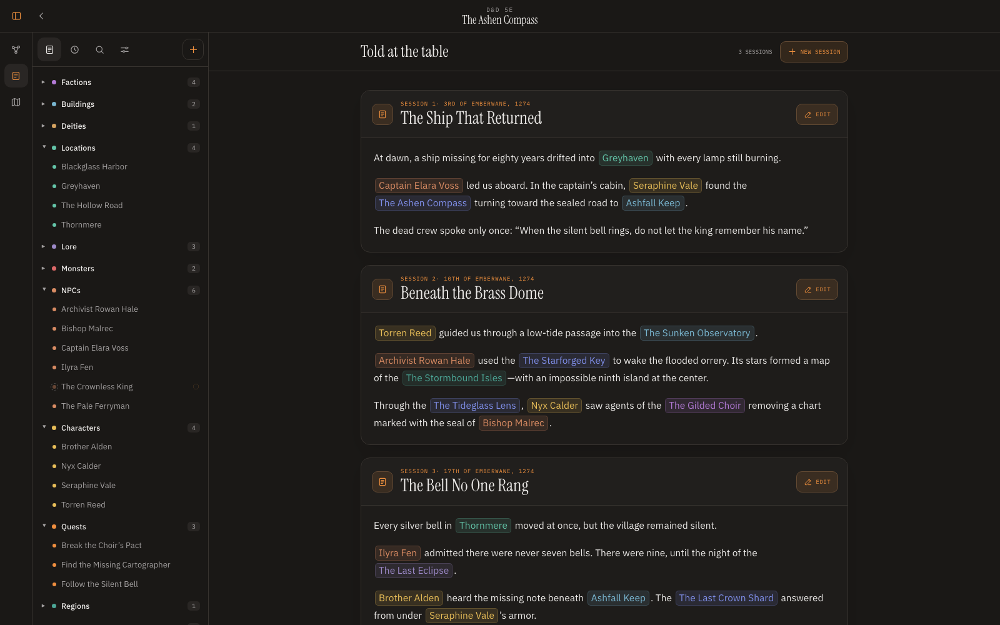
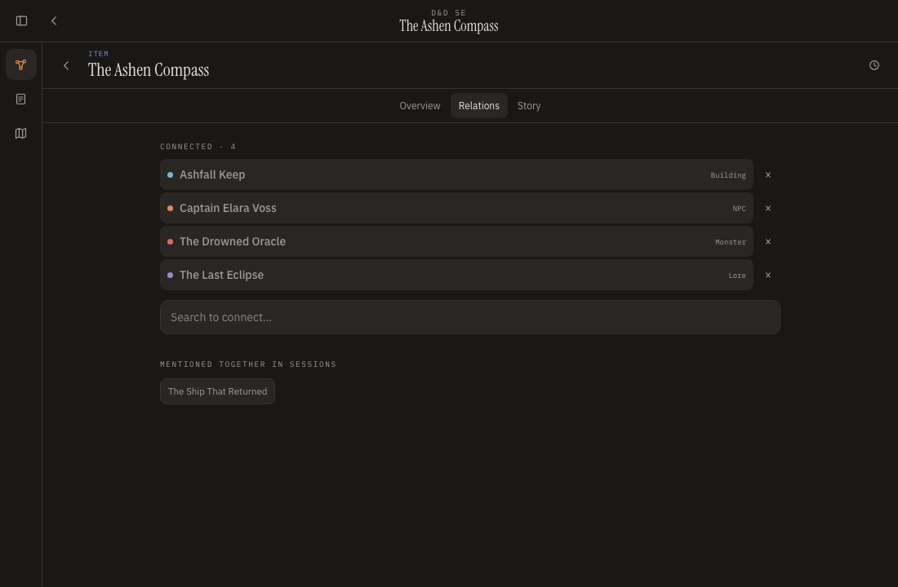
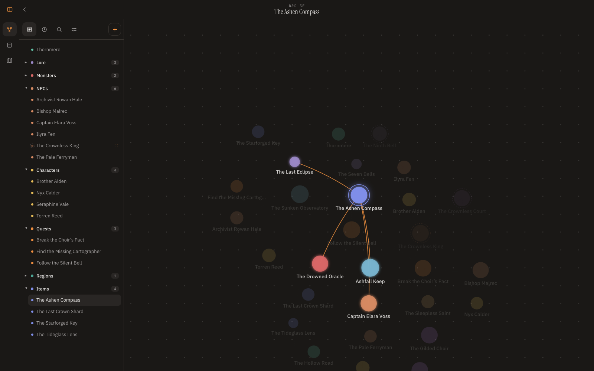
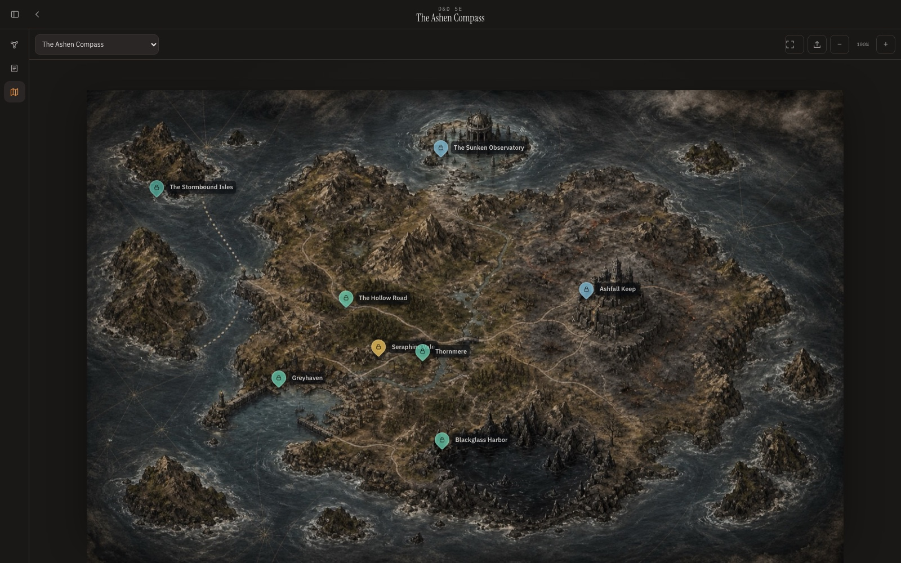
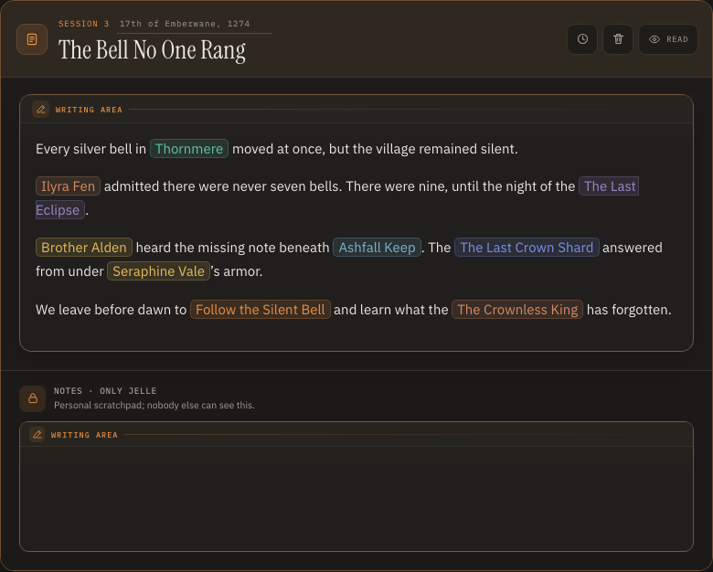
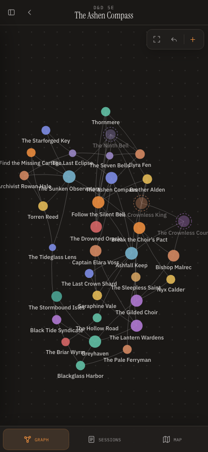

<p align="center">
  
</p>

<p align="center">
  <strong>Your campaign is a living world. Atlore helps the whole table remember it.</strong>
</p>

<p align="center">
  <a href="#what-is-atlore-really">About</a> ·
  <a href="#a-look-inside">Screenshots</a> ·
  <a href="#getting-started">Getting started</a> ·
  <a href="https://github.com/jellesiderius/atlore/releases/latest">Latest release</a> ·
  <a href="./CHANGELOG.md">Changelog</a> ·
  <a href="https://github.com/jellesiderius/atlore/wiki">Documentation</a> ·
  <a href="#architecture">Architecture</a> ·
  <a href="./LICENSE">MIT License</a>
</p>

<p align="center">
  <a href="./docs/assets/screenshots/atlore-graph.png">
    
  </a>
</p>

<p align="center">
  <sub><em>The Ashen Compass: one campaign, 34 nodes, 59 relationships, and a story that stays connected.</em></sub>
</p>

---

## What is Atlore, really?

Atlore is an open-source, self-hostable tabletop RPG campaign manager and collaborative worldbuilding knowledge graph. It is designed for Dungeons & Dragons, Daggerheart, and other story-driven TTRPGs.

In practice, it feels like a shared campaign notebook. Underneath, every character, location, faction, quest, item, and piece of lore is a connected node. Mention a node with `@` in a session or description and Atlore keeps the relationship and campaign context up to date.

The game master controls what is revealed. Players can contribute shared knowledge and keep private notes. Everyone works in the same living world, with realtime updates instead of scattered documents and stale recaps.

---

## What you do in Atlore

- **See the shape of your world.** Explore an Obsidian-style force graph, follow curved relationships, focus connected clusters, and drag an entire narrative swarm.
- **Write sessions without losing context.** Use `@` mentions for people, places, clues, and quests; Atlore turns them into navigable references and graph relationships.
- **Keep one continuous campaign story.** Read sessions in sequence, jump to any referenced dossier, and restore earlier versions when the canon changes.
- **Separate public knowledge from secrets.** Reveal nodes to everyone, selected players, or only yourself while keeping private notes beside the shared description.
- **Put the world on a map.** Upload campaign and location maps, drop linked nodes as markers, and keep their positions synchronized.
- **Build together live.** Editors, readers, presence, drafts, and cursors update through WebSockets across concurrent users.

---

## A look inside

<table>
  <tr>
    <td width="56%" valign="top">
      <a href="./docs/assets/screenshots/atlore-sessions.png">
        
      </a><br />
      <sub><strong>Write at the table, read as a story.</strong> Every coloured mention points back to a living node.</sub>
    </td>
    <td width="44%" valign="top">
      <a href="./docs/assets/screenshots/atlore-node-dossier.png">
        
      </a><br />
      <sub><strong>Knowledge with context.</strong> Dossiers connect descriptions, private notes, relations, maps, and story appearances.</sub>
    </td>
  </tr>
  <tr>
    <td width="50%" valign="top">
      <a href="./docs/assets/screenshots/atlore-graph-focus.png">
        
      </a><br />
      <sub><strong>Follow one thread.</strong> Selecting a node brings its direct relationships forward while the rest of the world recedes.</sub>
    </td>
    <td width="50%" valign="top">
      <a href="./docs/assets/screenshots/atlore-map.jpg">
        
      </a><br />
      <sub><strong>Give every place a position.</strong> Campaign locations become linked, draggable markers on a shared map.</sub>
    </td>
  </tr>
  <tr>
    <td width="62%" valign="top">
      <a href="./docs/assets/screenshots/atlore-session-editor.png">
        
      </a><br />
      <sub><strong>Capture the session while it happens.</strong> Shared writing, private notes, autosave, and live <code>@</code> references stay in one focused surface.</sub>
    </td>
    <td width="38%" valign="top" align="center">
      <a href="./docs/assets/screenshots/atlore-mobile.png">
        
      </a><br />
      <sub><strong>Take the campaign with you.</strong> Graph, sessions, and maps remain accessible on smaller screens.</sub>
    </td>
  </tr>
</table>

---

## Why Atlore

Campaign knowledge usually ends up split between notes, chat, a wiki, a virtual tabletop, and the game master's memory. Those tools store pages; they rarely preserve the relationships that make a fictional world feel coherent.

Atlore treats the relationship as first-class data. A name written during play can become a dossier, a graph edge, a map marker, and a future search result without copying the same fact into four systems. The graph is not decoration—it is a navigable model of what the table knows.

Atlore does not try to replace your virtual tabletop. It is the campaign memory beside it.

---

## Works today

| Worldbuilding                                        | At the table                                 | Self-hosting                                     |
| ---------------------------------------------------- | -------------------------------------------- | ------------------------------------------------ |
| Interactive force graph and connected swarm dragging | Realtime shared session writing and reading  | Docker Compose production stack                  |
| Built-in and custom node types                       | `@` autocomplete and automatic relationships | PostgreSQL migrations and seeded demo data       |
| Shared descriptions and private notes                | Live drafts, presence, and remote cursors    | Redis pub/sub and rate limiting                  |
| Hidden and selectively revealed nodes                | Version history and restoration              | S3-compatible media storage with MinIO           |
| Campaign and node maps with markers                  | Desktop and mobile navigation                | Health checks, CI, unit, browser, and load tests |

---

## Getting started

### I want to run Atlore

You need Docker Desktop—or Docker Engine with Compose—and GNU Make.

Use the **[latest GitHub release](https://github.com/jellesiderius/atlore/releases/latest)** if you want a versioned source archive without installing Git. Download the `.zip` or `.tar.gz`, extract it, open a terminal in the extracted `atlore-*` directory, and continue with:

```bash
cp .env.example .env
make up
make seed
```

Or clone the current `main` branch:

```bash
git clone https://github.com/jellesiderius/atlore.git
cd atlore
cp .env.example .env
make up
make seed
```

Open [http://localhost:3000](http://localhost:3000).

The demo world includes two accounts:

- `demo@atlore.app` / `AtloreDemo!2026` — game master
- `lena@atlore.app` / `AtloreDemo!2026` — player

Change the example passwords and every secret in `.env` before exposing the stack publicly.

### I want to develop Atlore

You need Node.js 22+ in addition to Docker.

```bash
npm install
make infra
make migrate
npm run dev
```

The Vite development server runs at [http://localhost:5173](http://localhost:5173). PostgreSQL, Redis, and MinIO continue to run in Docker.

<details>
<summary><strong>Common commands</strong></summary>

```bash
make help       # list all available commands
make up         # build and start the production stack
make down       # stop containers while preserving data
make restart    # restart the stack
make logs       # follow application logs
make status     # show health and container status
make tunnel-up   # start Atlore with the optional Cloudflare Tunnel
make tunnel-down # stop only the public tunnel
make seed       # load idempotent demo data
make seed-10k   # create a 10,000-node performance world
make check      # type checking, linting, and unit tests
make e2e        # Playwright on desktop and mobile
make test-10k   # real Chromium load and frame-budget test
make clean      # remove generated files only
make destroy    # remove containers and volumes after confirmation
```

</details>

---

## Documentation

Start with the **[Getting Started guide](https://github.com/jellesiderius/atlore/wiki/Getting-Started)**. The complete **[Atlore Wiki](https://github.com/jellesiderius/atlore/wiki)** covers:

- campaigns, invitations, roles, and player permissions;
- nodes, graph controls, relationships, and hidden information;
- sessions, `@` mentions, notes, and realtime collaboration;
- maps, media uploads, markers, and drag-and-drop;
- account preferences, themes, languages, and passwords;
- self-hosting, Cloudflare Tunnel, environment configuration, backups, and troubleshooting.

---

## Architecture

```text
Browser / installable PWA
          │
          ├── HTTP ──────── SvelteKit application ───── PostgreSQL
          │                       │
          └── WebSocket ──────────┼──────────────────── Redis
                                  │
                                  └──────────────────── S3 / MinIO
```

The application uses a component-based Svelte 5 architecture. Routes coordinate state and API calls; reusable components own graph, editor, map, node, session, and workspace behaviour. Pure domain logic and server services remain separate from the interface.

<details>
<summary><strong>Source map</strong></summary>

```text
src/
├── lib/components/
│   ├── account/       profile, theme, language, and password settings
│   ├── auth/          authentication screens
│   ├── campaign/      campaign cards and management
│   ├── graph/         canvas graph, worker layout, and controls
│   ├── map/           maps and markers
│   ├── node/          dossiers and relationships
│   ├── richtext/      shared editor, viewer, mentions, and cursors
│   ├── session/       session editor and continuous story
│   ├── ui/            reusable interface primitives
│   └── workspace/     navigation, explorer, search, and history
├── lib/domain/        pure search, ACL, graph, text, and diff logic
├── lib/i18n/          English and Dutch YAML catalogs
├── lib/server/        auth, database, mail, storage, Redis, and services
├── routes/api/        validated SvelteKit JSON endpoints
└── workers/           force layout outside the main thread
```

</details>

The runtime uses SvelteKit 2, Svelte 5, TypeScript, Vite, Tailwind CSS 4, PostgreSQL 17 with Drizzle ORM, Redis, WebSockets, and S3-compatible object storage. Composer is intentionally absent because Atlore has no PHP runtime or PHP dependencies.

---

## Configuration and production

All configuration is supplied through `.env` and validated at startup. See [`.env.example`](./.env.example) for the complete reference.

For a public deployment:

- set `NODE_ENV=production` and `ORIGIN` to the exact public HTTPS origin;
- add only deliberate preview or proxy domains to `TRUSTED_ORIGINS`;
- replace every example database, realtime, session, and object-storage secret;
- configure SMTP for password recovery and campaign invitations;
- terminate TLS at a trusted reverse proxy or load balancer;
- back up PostgreSQL and object storage regularly.

Without S3 configuration, Atlore falls back to `STORAGE_PATH`. Without Redis, one application process remains functional, but horizontal realtime synchronization requires Redis.

<details>
<summary><strong>Cloudflare Tunnel</strong></summary>

Atlore includes an optional Docker Compose profile for a remotely-managed Cloudflare Tunnel. Create a named tunnel and published application in Cloudflare, route its public hostname to `http://app:3000` (select **HTTP** and enter **`app:3000`** when Cloudflare shows separate fields), and set these values in `.env`:

```dotenv
ORIGIN=https://atlore.example.com
CLOUDFLARED_TUNNEL_TOKEN=your-connector-token
HOST_BIND_ADDRESS=127.0.0.1
```

Then start and inspect it with:

```bash
make tunnel-check
make tunnel-up
make tunnel-status
make tunnel-logs
```

The same HTTPS hostname carries normal requests and realtime WebSockets. No database, Redis, MinIO, or inbound origin port is published to the internet. See the complete **[Cloudflare Tunnel guide](https://github.com/jellesiderius/atlore/wiki/Cloudflare-Tunnel)** for dashboard setup, security, operations, and troubleshooting.

</details>

<details>
<summary><strong>Database and migrations</strong></summary>

```bash
npm run db:generate  # generate a migration after schema changes
npm run db:migrate   # apply migrations
npm run db:seed      # populate the demo world idempotently
npm run db:studio    # open Drizzle Studio
```

Create a PostgreSQL backup with:

```bash
docker compose exec -T postgres pg_dump -U atlore -Fc atlore > atlore.backup
```

</details>

<details>
<summary><strong>Translations</strong></summary>

Interface, API, and email copy lives in `src/lib/i18n/locales/en.yaml` and `src/lib/i18n/locales/nl.yaml`. Add the same semantic key and interpolation fields to both files. Catalog tests verify parity and every statically referenced translation key.

</details>

---

## Quality and security

```bash
npm run check        # Svelte and TypeScript diagnostics
npm run lint         # ESLint for TypeScript, JavaScript, and Svelte
npm test             # domain and server unit tests
npm run test:e2e     # API and browser flows on desktop and mobile
npm run test:load    # 10k-node load, motion, FPS, and long-task test
npm run build        # adapter-node production build
```

Every mutation is schema-validated and rechecks campaign permissions and node visibility on the server. Hidden nodes are removed from player payloads. Session cookies are `HttpOnly`, `SameSite=Lax`, and secure over HTTPS. Non-idempotent requests enforce their origin. Responses include CSP, framing, MIME, referrer, and permissions protections; realtime tokens are short-lived and HMAC-signed.

---

## Contributing

Issues and pull requests are welcome. Read [CONTRIBUTING.md](./CONTRIBUTING.md) for the development workflow.

Release history lives in [CHANGELOG.md](./CHANGELOG.md). Releases require explicit maintainer approval and are published through the gated manual workflow described in [docs/RELEASING.md](./docs/RELEASING.md); ordinary pushes and tags never publish a release automatically.

Atlore is released under the [MIT License](./LICENSE).

---

<p align="center">
  <sub>Atlore · Keep the world connected.</sub>
</p>
